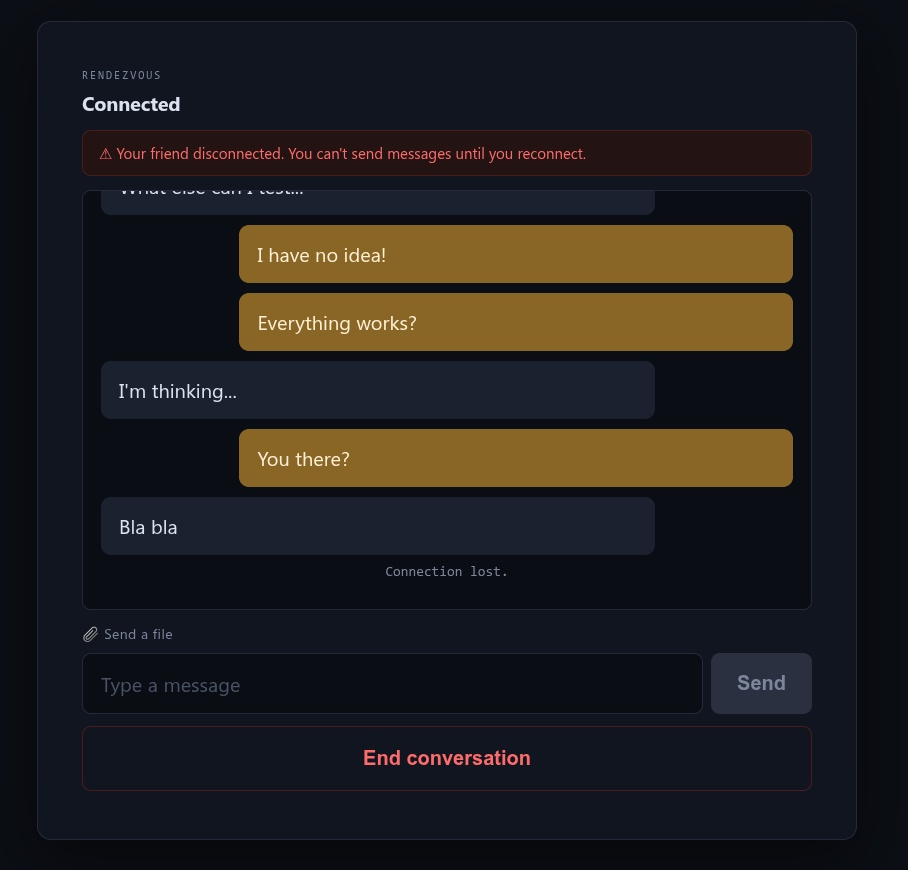

# Rendezvous — Encrypted P2P Chat

## Overview
A private, peer-to-peer encrypted chat app for two people to talk and share files directly, with no account, no install, and no central server storing anything. Built for situations where you've lost touch with someone and want a simple, reliable way to reconnect at a prearranged time — no technical steps, no codes to copy.

## Features
- One shared PIN or passphrase — no tokens, no copy/pasting connection codes
- End-to-end encryption (AES-256-GCM) for both messages and files
- Photos display inline in the chat, with a hover-to-save button
- Automatic disconnect detection — you're notified the moment your friend drops, instead of messaging into silence
- Works behind NAT/firewalled networks via STUN/TURN (Cloudflare)
- No account, no server-side message storage

## How to Use
1. Both people open the page in a browser (desktop or mobile).
2. Both enter the **same** PIN or passphrase — agree on this beforehand, in person or through a trusted channel.
3. Both click **Connect** at the agreed time. Whoever connects first waits; the second person is matched automatically.
4. Chat and send files/photos once connected.

There is no host/client distinction to manage — either person can click Connect first and it works the same way.

## Requirements
- A modern browser (Chrome, Firefox, or Edge) with WebRTC support
- An internet connection (works on restrictive/public networks in most cases)

## How It Works
The two browsers are introduced to each other using a free public matchmaking service (PeerJS), keyed off a one-way hash of your PIN — the PIN itself is never transmitted or stored anywhere. Once matched, chat and files travel directly between the two browsers. If a direct path isn't possible (e.g., strict firewalls), traffic relays through a TURN server, but that relay only ever sees encrypted data.

## Security
- **Messages and files** are encrypted with AES-256-GCM, using a key derived from your shared PIN via PBKDF2.
- **The connection itself** is also encrypted by WebRTC (DTLS), independent of the above — this is mandatory in the WebRTC standard, not optional.
- **The matchmaking and relay services** never see your PIN or your message/file content — only an anonymous hash used for connecting, and encrypted traffic they cannot read.
- Disconnects are actively detected (via a periodic check-in between the two browsers), so a dropped connection is surfaced immediately instead of failing silently.

## Disclaimer
This protects your conversation from network eavesdroppers and from the services used to connect you. It does **not** protect against someone with physical or remote access to either computer itself (e.g., a public computer with keylogging software already installed). Use your judgment about the device you're on.

## License
MIT License
